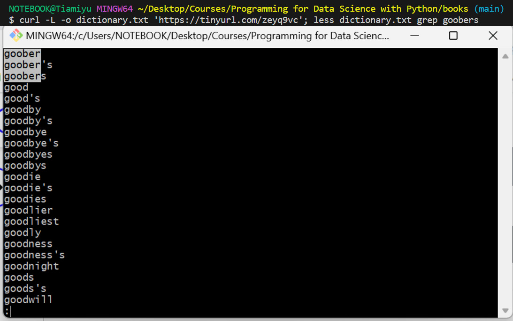
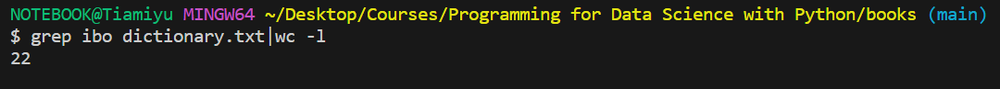

# Shell Workshop

## Learning Objectives

- Recognize the importance of the Shell terminal for a Web Developer.
- Operate with a Shell terminal using multiple commands.
- Practice various commands to perform different operations like navigating directories, files organization, etc.

## Shell Commands
- echo: like print in python
    - echo 'Hello World'
- ls: List the files in the directory
    - ls Downloads
- cd: Move to a different directory
    - cd 'My Documents'
- pwd: Print Working Directory
- ls -l: long formatting for files
- mkdir: Creates directories
- mv: Move files from a directory to another
- CURL: is used in command lines or scripts to transfer data (download data)
    - curl -L -o dictionary.txt 'https://tinyurl.com/zeyq9vc'
- cat: View file content
- less: View file content screen by screen
    - use '/' to search
- rm: Delete files
    - rm 'filename'
- rmdir: Delete directories
- grep: "global regular expression print,” processes text line by line and prints any lines which match a specified pattern
- wc: "short for word count" reads either standard input or a list of files and generates one or more of the following statistics: newline count, word count, and byte count

## Questions
1. Using the dictionary.txt file and the less command, find out the next word after the word goobers in this dictionary.
    - ANS: good    
    - 

2. How many words are there in dictionary.txt that match the pattern ibo?
    - ANS: 22    
    - 
